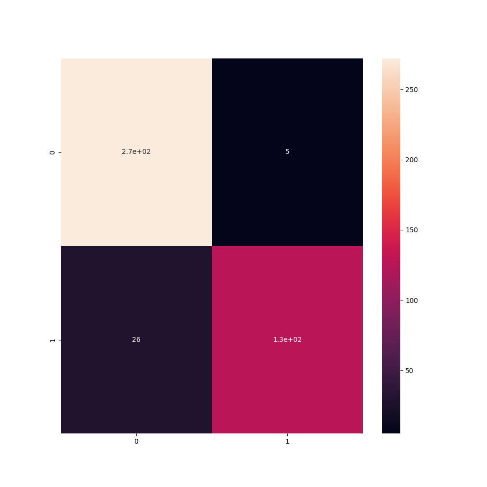
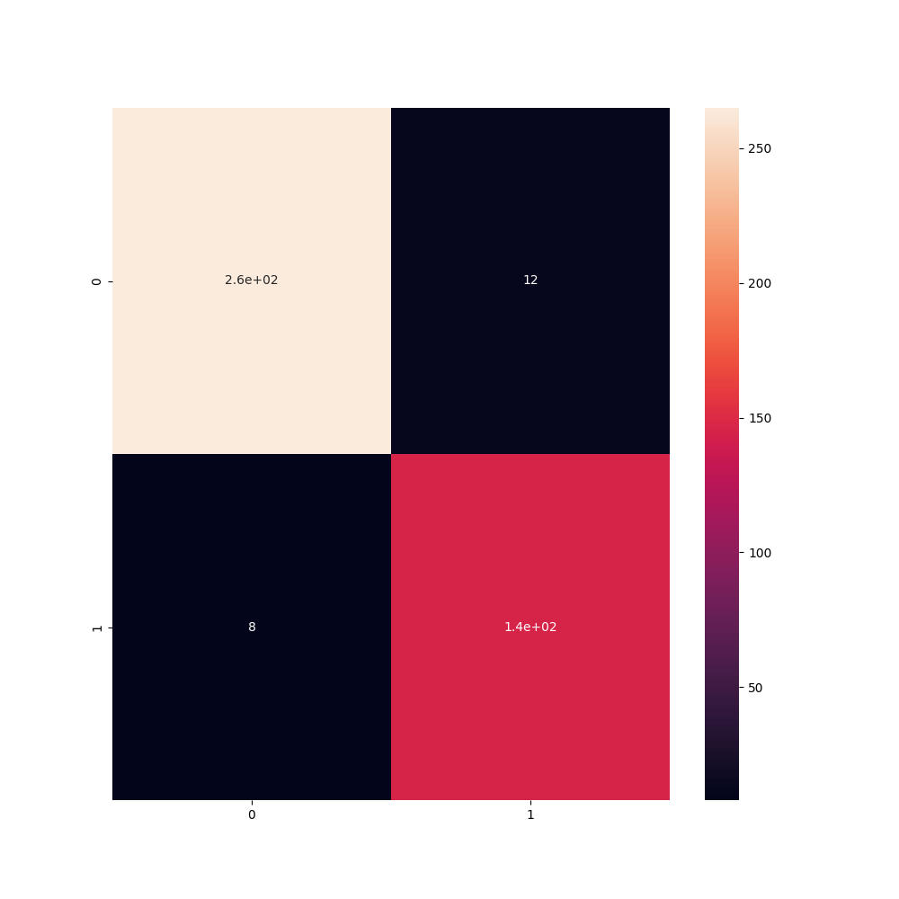
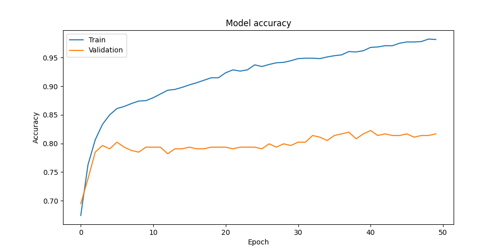
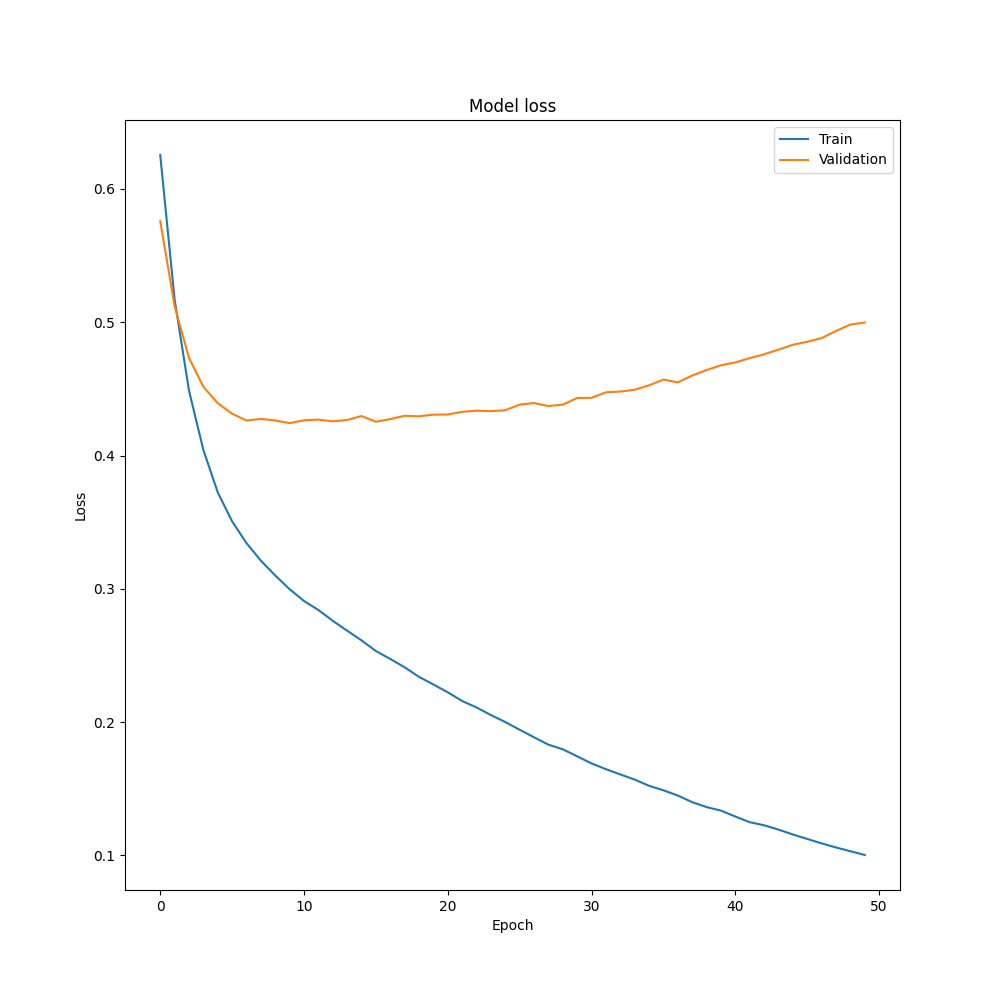
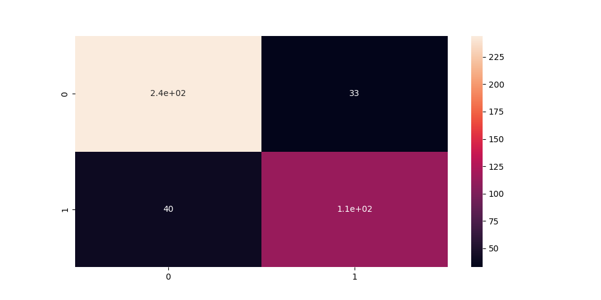

# Alzheimer's Disease Predictions

## Table of Contents
- [Alzheimer's Disease Predictions](#alzheimers-disease-predictions)
  - [Table of Contents](#table-of-contents)
  - [Introduction](#introduction)
  - [Importing Libraries](#importing-libraries)
  - [Data](#data)
  - [Descriptive Analysis](#descriptive-analysis)
    - [Correlation Heatmap](#correlation-heatmap)
    - [Diagnosis Distribution](#diagnosis-distribution)
    - [Boxplot of Features](#boxplot-of-features)
  - [Preprocessing](#preprocessing)
  - [Machine Learning Models](#machine-learning-models)
    - [Logistic Regression](#logistic-regression)
        - [Confusion Matrix](#confusion-matrix)
    - [Random Forest](#random-forest)
        - [Confusion Matrix](#confusion-matrix-1)
    - [XGBoost](#xgboost)
        - [Confusion Matrix](#confusion-matrix-2)
  - [Deep Learning](#deep-learning)
    - [Artificial Neural Network (ANN)](#artificial-neural-network-ann)
        - [Accuracy and Loss Plots](#accuracy-and-loss-plots)
        - [Confusion Matrix](#confusion-matrix-3)
  - [Results](#results)
  - [Conclusion](#conclusion)
  - [References](#references)

## Introduction
This project focuses on predicting Alzheimer's Disease using various machine learning and deep learning models. The dataset used in this project is obtained from `alzheimers_disease_data.csv`.

## Importing Libraries
- pandas
- numpy
- matplotlib
- seaborn
- scikit-learn
- keras
- xgboost

## Data
The dataset is loaded from a CSV file named `alzheimers_disease_data.csv` from .

## Descriptive Analysis
- Checked dimensions, missing values, data types, and basic statistics of the dataset.
- Dropped the `DoctorInCharge` column as it was not useful for the analysis.

### Correlation Heatmap

### Diagnosis Distribution

### Boxplot of Features

## Preprocessing
- Split the data into features and target variables.
- Split the data into training and testing sets.
- Standardized the data.

## Machine Learning Models

### Logistic Regression
- Performed logistic regression with cross-validation.
- Evaluated the model using accuracy, precision, recall, F1 score, and ROC AUC score.

##### Confusion Matrix

### Random Forest
- Performed Random Forest classification with cross-validation.
- Evaluated the model using accuracy, precision, recall, F1 score, and ROC AUC score.

##### Confusion Matrix

### XGBoost
- Performed XGBoost classification with cross-validation.
- Evaluated the model using accuracy, precision, recall, F1 score, and ROC AUC score.

##### Confusion Matrix

## Deep Learning

### Artificial Neural Network (ANN)
- Defined and trained an ANN model.
- Evaluated the model using accuracy, precision, recall, F1 score, and ROC AUC score.
- Plotted training accuracy and loss.

##### Accuracy and Loss Plots

##### Confusion Matrix

## Results
The project compares the performance of different machine learning and deep learning models for Alzheimer's Disease prediction. The evaluation metrics include accuracy, precision, recall, F1 score, and ROC AUC score.

## Conclusion
Based on the results, each model provides different levels of accuracy and performance. The selection of the best model depends on the specific use case and requirements.

## References
- Dataset: `alzheimers_disease_data.csv`
- Libraries: pandas, numpy, matplotlib, seaborn, scikit-learn, keras, xgboost
